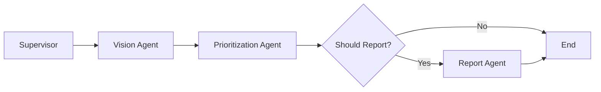

# 🛣️ SafeRoad-Guardian

**AI-Powered Road Safety Monitoring with Voice Alerts & Authority Reporting**

SafeRoad-Guardian is an intelligent road safety system that detects road hazards, alerts drivers with voice warnings, and automatically generates authority reports. Upload a road image with GPS coordinates, and the system will:
1. 🔍 Detect potholes and road signs using dual YOLO models
2. 🔊 Play professional voice alerts for immediate safety warnings
3. 📱 Generate WhatsApp/Email ready reports for road authorities
4. 💾 Save to memory to prevent duplicate reports

[](https://www.python.org/)
[](https://github.com/langchain-ai/langgraph)
[](https://github.com/ultralytics/ultralytics)
[](LICENSE)

## 🎥 Demo

**Video Demo:** [Watch on YouTube](YOUR_YOUTUBE_LINK_HERE)

**Live Demo:** Coming soon

## 📋 Table of Contents

- [Features](#-features)
- [Architecture](#-architecture)
- [Installation](#-installation)
- [Quick Start](#-quick-start)
- [Project Structure](#-project-structure)
- [How It Works](#-how-it-works)
- [Models](#-models)
- [Memory System](#-memory-system)
- [API Reference](#-api-reference)
- [Contributing](#-contributing)
- [License](#-license)

## ✨ Core Features

### 🎯 What This System Does (Real-World Use)

**For Drivers:**
- Upload a photo of the road ahead (from dashcam or phone)
- System detects potholes in ~1 second
- Hear VOICE ALERT: *"Danger. Road hazard detected. Use caution."*
- Continue driving safely

**For Authorities:**
- System generates WhatsApp/Email ready report automatically
- Includes: GPS coordinates, Google Maps link, photo (base64), severity level
- Ready to send to: Sri Lanka RDA, India PWD, US 311, UK FixMyStreet
- Copy-paste to notify authorities instantly

**Smart Memory:**
- Remembers reported locations for 7 days
- Prevents duplicate reports to authorities
- "Already notified" message if same spot reported recently

### 🚀 Killer Features (Competition-Winning)

1. **🔊 Professional Voice Alerts**
   - Gemini AI-powered natural language generation
   - Emergency-style warnings like premium cars
   - Plays actual audio through speakers
   - Severity-aware: "Caution" → "Danger" → "Critical Danger"

2. **📱 Instant Authority Reporting**
   - WhatsApp/Email ready format (copy-paste to send)
   - Base64-encoded photos attached
   - Google Maps links for navigation
   - Multi-country authority contact info

3. **🤖 Multi-Agent AI (LangGraph)**
   - 4 coordinated agents work like a professional team
   - Supervisor → Vision → Prioritization → Report
   - Intelligent routing based on detection results

4. **💾 Smart Memory (ChromaDB)**
   - GPS-based duplicate prevention
   - 7-day deduplication window
   - Historical hazard tracking

## 🏗️ Architecture


### System Flow

1. **Image Input** → Supervisor Agent validates and initiates workflow
2. **Vision Analysis** → YOLO models detect hazards and signs
3. **Prioritization** → Memory check + severity assessment
4. **Report Generation** → Comprehensive report saved to memory bank

### Multi-Agent Workflow



## 🚀 Installation

### Prerequisites

- Python 3.8 or higher
- pip package manager
- Git
- Google Gemini API key ([Get one here](https://makersuite.google.com/app/apikey))

### Step 1: Clone the Repository

```bash
git clone https://github.com/YOUR_USERNAME/SafeRoad-Guardian.git
cd SafeRoad-Guardian
```

### Step 2: Create Virtual Environment

```bash
# Windows
python -m venv venv
venv\Scripts\activate

# Linux/Mac
python3 -m venv venv
source venv/bin/activate
```

### Step 3: Install Dependencies

```bash
pip install -r requirements.txt
```

### Step 4: Download Model Weights

Place your trained YOLO model weights in the `models/` folder:

- `models/pothole_model.pt` - Road hazard detection model
- `models/road_sign_model.pt` - Road sign detection model

### Step 5: Configure Environment

Create a `.env` file in the root directory:

```bash
cp .env.example .env
```

Edit `.env` and add your Gemini API key:

```
GEMINI_API_KEY=your_actual_api_key_here
```

## 🎯 Quick Start

### Run Analysis (Upload Image)

```bash
# Basic command - USE YOUR OWN IMAGE
python main.py YOUR_IMAGE.jpg "YOUR_GPS_COORDINATES"

# Example with provided test image
python main.py sample_images\pothole\United_States_004347.jpg "35.6762,139.6503"
```

**How to get YOUR image:**
1. Take photo of road with your phone/dashcam
2. Save to `SafeRoad-Guardian/` folder
3. Get GPS: Open Google Maps → Right-click location → Copy coordinates
4. Run: `python main.py my_photo.jpg "latitude,longitude"`

### What You'll See (Example Output)

```
0: 640x640 1 pothole, 227.8ms
Speed: 95.6ms preprocess, 227.8ms inference, 1.4ms postprocess

🔊 ====================================================================
   VOICE ALERT: Danger. Road hazard detected. Use caution.
   ====================================================================

======================================================================
📱 WHATSAPP / EMAIL READY REPORT (COPY-PASTE TO AUTHORITY)
======================================================================

🚨 NEW ROAD HAZARD REPORTED

📍 Location    : 35.6762,139.6503
🗺️  Google Maps : https://maps.google.com/?q=35.6762,139.6503
⚠️  Severity    : HIGH
🔍 Details     : pothole (conf 0.80, size 744px)
🕐 Timestamp   : 2025-12-01T19:31:21
📷 Photo       : Attached (base64 ready)
🤖 Source      : SafeRoad-Guardian AI System

----------------------------------------------------------------------
📨 READY FOR:
   • Sri Lanka RDA: rda@transport.gov.lk
   • India PWD: complaints@pwd.gov.in
   • US 311: Via mobile app or portal
   • UK FixMyStreet: https://fixmystreet.com
======================================================================

✓ Analysis completed successfully!
```

## 📁 Project Structure

```
SafeRoad-Guardian/
│
├── agents/                      # Multi-agent system
│   ├── supervisor.py           # Supervisor agent
│   ├── vision_agent.py         # Vision processing agent
│   ├── prioritization_agent.py # Prioritization logic
│   └── report_agent.py         # Report generation
│
├── tools/                       # Custom tools
│   └── vision_tools.py         # YOLO detection functions
│
├── memory/                      # Memory system
│   └── memory_bank.py          # ChromaDB integration
│
├── models/                      # YOLO model weights
│   ├── pothole_model.pt        # Road hazard model
│   └── road_sign_model.pt      # Road sign model
│
├── sample_images/               # Test images
│   └── pothole_colombo.jpg
│
├── images/                      # Documentation assets
│   └── architecture.png
│
├── memory_db/                   # ChromaDB storage (auto-created)
│
├── main.py                      # Main application entry point
├── requirements.txt             # Python dependencies
├── .env.example                 # Environment template
├── .gitignore                   # Git ignore rules
└── README.md                    # This file
```

## 🔧 How It Works

### 1. Vision Tools (`tools/vision_tools.py`)

Two custom functions powered by YOLO:

- **`detect_road_hazards(image_path)`**: Detects potholes, cracks, and road damage
- **`detect_and_assess_signs(image_path)`**: Identifies signs and assesses condition

### 2. Memory Bank (`memory/memory_bank.py`)

ChromaDB-based persistent storage:

- **`save_report()`**: Stores hazard reports with GPS and timestamps
- **`was_recently_reported()`**: Checks for duplicate reports within 7 days
- **`get_location_history()`**: Retrieves historical data for locations

### 3. Multi-Agent System

#### Supervisor Agent
- Validates inputs
- Coordinates workflow
- Handles errors

#### Vision Agent
- Loads YOLO models
- Processes images
- Extracts detection results

#### Prioritization Agent
- Checks memory for duplicates
- Assesses hazard severity
- Decides whether to report

#### Report Agent
- Generates comprehensive reports
- Saves to memory bank
- Outputs formatted results

## 🎯 Models

### Pothole Detection Model (`pothole_model.pt`)

- **Architecture**: YOLOv8
- **Classes**: pothole, crack, damaged_road
- **Input**: Road surface images
- **Output**: Bounding boxes with confidence scores and size estimates

### Road Sign Model (`road_sign_model.pt`)

- **Architecture**: YOLOv8
- **Classes**: Various road signs (stop, yield, speed_limit, etc.)
- **Input**: Road scene images
- **Output**: Sign detection + condition assessment (faded/good)

## 💾 Memory System

The memory bank uses **ChromaDB** for efficient vector storage:

- **Persistent Storage**: Data survives across runs
- **Deduplication**: Prevents reporting same location within 7 days
- **Similarity Search**: GPS-based location matching
- **Metadata**: Stores timestamps, images, GPS coordinates

## 📚 API Reference

### Main Function

```python
from main import run_analysis

result = run_analysis(
    image_path="path/to/image.jpg",
    gps="6.9271,79.8612"
)
```

### Vision Tools

```python
from tools.vision_tools import detect_road_hazards, detect_and_assess_signs

hazards = detect_road_hazards("image.jpg")
signs = detect_and_assess_signs("image.jpg")
```

### Memory Operations

```python
from memory.memory_bank import save_report, was_recently_reported

# Check if location was reported recently
is_duplicate = was_recently_reported("6.9271,79.8612", days=7)

# Save a new report
save_report(
    gps="6.9271,79.8612",
    hazards="pothole detected",
    signs="stop sign good",
    image_path="image.jpg"
)
```

## 🛠️ Development

### Running Tests

```bash
# Test with sample image
python main.py sample_images/pothole_colombo.jpg

# Test with custom GPS
python main.py sample_images/test.jpg "7.8731,80.7718"
```

### Adding New Models

1. Train your YOLO model
2. Export to `.pt` format
3. Place in `models/` folder
4. Update `tools/vision_tools.py` to load your model

### Customizing Agents

Each agent can be customized by editing files in the `agents/` folder. The LangGraph workflow is defined in `main.py`.

## 🤝 Contributing

Contributions are welcome! Please feel free to submit a Pull Request.

1. Fork the repository
2. Create your feature branch (`git checkout -b feature/AmazingFeature`)
3. Commit your changes (`git commit -m 'Add some AmazingFeature'`)
4. Push to the branch (`git push origin feature/AmazingFeature`)
5. Open a Pull Request

## 📄 License

This project is licensed under the MIT License - see the [LICENSE](LICENSE) file for details.

## 🙏 Acknowledgments

- **LangChain & LangGraph**: Multi-agent framework
- **Google Gemini**: LLM for agent coordination
- **Ultralytics YOLO**: Computer vision models
- **ChromaDB**: Vector database for memory
- **Sri Lankan Road Infrastructure Data**: Training data sources

## 📧 Contact

For questions or support, please open an issue on GitHub or contact [hmsanth@gmail.com].

---

**Built with ❤️ for safer roads everywhere**
